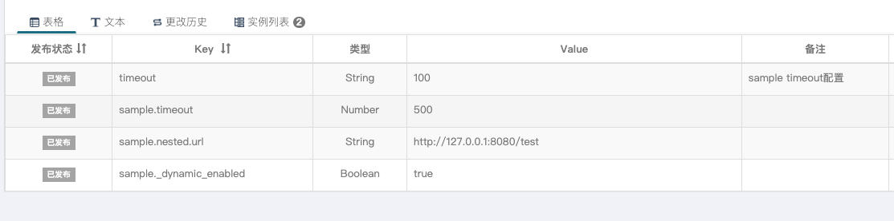

## Introduce
> Support for apollo-client to dynamic auto refresh `@ConfigurationProperties` bean.
> 
> See about: [Apollo](https://github.com/ctripcorp/apollo)

## QuickStart

#### 1. Import dependency
Maven:
```xml
<dependency>
    <groupId>com.github.selfancy</groupId>
    <artifactId>apollo-client-refresh-configbean</artifactId>
    <version>${RELEASE_VERSION}</version>
</dependency>
```
Gradle:
```groovy
implementation "com.github.selfancy:apollo-client-refresh-configbean:${RELEASE_VERSION}"
```
#### 2. Annotated at SpringBoot ConfigurationProperties Bean

Both required annotation `@DynamicProperties` and `@ConfigurationProperties`.

Sample:
```java
@Data
@DynamicProperties
@ConfigurationProperties("sample")
public class SampleProperties {
    
    private int timeout;
}
```


## ChangeList
- 1.0.1.RELEASE (2024-02-06)
  - Support springboot 2.4.0+
  - Add enableProperty to change Dynamic status. see: [DynamicProperties.java](src/main/java/com/github/selfancy/apollo/DynamicProperties.java)

- 1.0.0.RELEASE (2021-03-30)
  - Init

## License
[http://www.apache.org/licenses/LICENSE-2.0](http://www.apache.org/licenses/LICENSE-2.0)